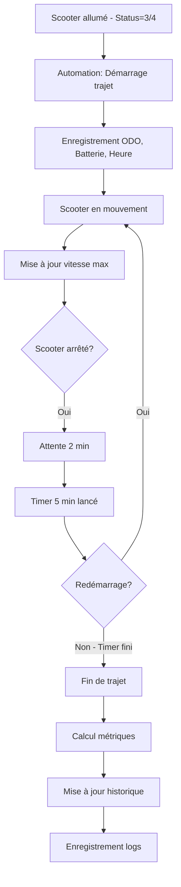

# Silence Scooter - HomeAssistant Integration

> **Objectif du projet** : Migrer le package YAML `silence_addon.yaml` vers un Custom Component Python (`silencescooter/`) pour améliorer la maintenabilité, l'extensibilité et l'intégration native avec HomeAssistant.

## Vue d'ensemble

Ce projet permet l'intégration complète d'un scooter électrique **Silence** équipé d'un module **Astra** dans HomeAssistant. Le module Astra émet en temps réel des données télémétriques via MQTT, qui sont ensuite traitées pour créer un système avancé de suivi et d'analyse.

### Évolution du projet

**Phase 1 : Configuration YAML de base** (`silence.yaml`)
- Récupération des données brutes MQTT du module Astra
- Affichage des capteurs natifs du scooter
- **Statut : Stable, conservé tel quel**

**Phase 2 : Package YAML avancé** (`silence_addon.yaml`)
- Ajout de fonctionnalités de suivi des trajets
- Calcul des coûts énergétiques
- Estimation d'autonomie
- Historique des trajets
- **Statut : Fonctionnel mais limité par les contraintes YAML**

**Phase 3 : Migration vers Custom Component Python** (`silencescooter/`)
- **OBJECTIF : Refondre complètement `silence_addon.yaml` en Python**
- Transformer toutes les automations YAML en code Python
- Migrer tous les `input_number`, `input_datetime`, `sensor` template vers des entités Python natives
- Remplacer les scripts YAML par des services Python
- Conserver uniquement `silence.yaml` pour les capteurs MQTT de base
- **Avantages :**
  - Meilleure maintenabilité et extensibilité
  - Configuration UI via Config Flow
  - Meilleure gestion des états et événements
  - Code typé et testable
  - Intégration native HomeAssistant

---

## Architecture des fichiers

```
silence/
├── silence.yaml              # [CONSERVÉ] Capteurs MQTT bruts du module Astra
├── silence_addon.yaml        # [À MIGRER] Package YAML avec fonctionnalités avancées
├── silence_logs.log          # [DEPRECATED] Logs - à migrer vers data/
├── CLAUDE.md                 # Cette documentation
└── silencescooter/           # [CIBLE] Custom Component Python
    ├── __init__.py           # Initialisation de l'intégration
    ├── manifest.json         # Métadonnées du composant
    ├── const.py              # Constantes globales
    ├── config_flow.py        # Interface de configuration UI
    ├── sensor.py             # Entités sensor (remplace sensors template YAML)
    ├── number.py             # Entités number (remplace input_number YAML)
    ├── datetime.py           # Entités datetime (remplace input_datetime YAML)
    ├── switch.py             # Entités switch (remplace input_boolean YAML)
    ├── utility_meter.py      # Compteurs d'énergie (remplace utility_meter YAML)
    ├── automations.py        # Automations (remplace automations YAML)
    ├── definitions.py        # Définitions des entités
    ├── services.py           # Services (remplace scripts/shell_command YAML)
    ├── helpers.py            # Fonctions utilitaires
    ├── data/                 # Stockage des données persistantes
    │   └── history.json          # Historique des trajets (IMPLÉMENTÉ)
    └── scripts/
        ├── __init__.py
        └── history.sh            # Script bash pour mise à jour de l'historique
```

---

## Dossier `data/` - Stockage persistant

Le dossier `silencescooter/data/` centralise tous les fichiers de données générés par l'intégration.

### Fichier actuel

#### `history.json` ✅ IMPLÉMENTÉ
Historique des trajets au format JSON :
```json
[
  {
    "start_time": "2025-05-28T19:03:08+00:00",
    "end_time": "2025-05-28T19:14:34+00:00",
    "duration": "11.0",
    "distance": "1.0",
    "avg_speed": "5.5",
    "max_speed": "49.0",
    "battery": "2.0",
    "outdoor_temp": "17.5"
  },
  ...
]
```
- Conservation de l'historique complet des trajets
- Mise à jour automatique à chaque fin de trajet via `scripts/history.sh`
- Utilisé pour alimenter le sensor `sensor.scooter_trips_history`

### Gestion des fichiers

**Création automatique :**
- Le dossier `data/` est créé au premier lancement si inexistant
- Le fichier `history.json` est créé lors du premier trajet

**Accès depuis le code :**
```python
from .const import HISTORY_FILE, HISTORY_SCRIPT

# Dans const.py
HISTORY_FILE = DATA_PATH / "history.json"
HISTORY_SCRIPT = SCRIPTS_PATH / "history.sh"
```

**Mise à jour de l'historique :**
- Via le script bash `scripts/history.sh` appelé par `helpers.update_history()`
- Utilise `jq` pour manipuler le JSON
- Ajoute les nouveaux trajets en début de liste

### Logs applicatifs

Les logs des événements sont actuellement écrits dans :
- `/config/silence_logs.log` via `helpers.log_event()`
- Logs Home Assistant (niveau debug activable via `configuration.yaml`)

### Fonctionnalités futures possibles

Les fichiers suivants pourraient être ajoutés ultérieurement :
- `scooter_events.log` : Journal dédié aux événements du scooter
- `statistics.json` : Statistiques cumulées (distance totale, consommation moyenne, etc.)
- `config.json` : Configuration persistante de l'intégration

---

## Stratégie de migration

### Ce qui reste en YAML (`silence.yaml`)
Les capteurs MQTT de base restent en YAML car :
- Ils sont directement liés au module Astra
- Configuration MQTT simple et efficace
- Pas de logique métier complexe
- Stable et fonctionnel

### Ce qui est migré vers Python (`silencescooter/`)

| Composant YAML | Équivalent Python | Fichier |
|---|---|---|
| `input_number.*` | `NumberEntity` | `number.py` |
| `input_datetime.*` | `DateTimeEntity` | `datetime.py` |
| `input_boolean.*` | `SwitchEntity` | `switch.py` |
| `sensor.template.*` | `SensorEntity` | `sensor.py` |
| `utility_meter.*` | Entités custom | `utility_meter.py` |
| `automation.*` | Event listeners | `automations.py` |
| `script.*` | Services | `services.py` |
| `shell_command.*` | Services Python | `services.py` |

### Exemple de migration

**Avant (YAML)** :
```yaml
input_number:
  scooter_last_trip_distance_internal:
    name: "Distance du dernier trajet interne"
    min: 0
    max: 1000
    step: 0.1
    unit_of_measurement: "km"
```

**Après (Python)** :
```python
class ScooterTripDistanceNumber(NumberEntity):
    _attr_name = "Distance du dernier trajet"
    _attr_native_min_value = 0
    _attr_native_max_value = 1000
    _attr_native_step = 0.1
    _attr_native_unit_of_measurement = "km"
```

---

## Données du module Astra (silence.yaml)

### Capteurs disponibles

Le module Astra transmet via MQTT les données suivantes :

#### Commandes (Boutons)
- `TURN_ON_SCOOTER` / `TURN_OFF_SCOOTER` - Allumage/extinction à distance
- `FLASH` - Feux clignotants
- `BEEP_FLASH` - Alarme sonore + clignotants
- `OPEN_SEAT` - Ouverture de la selle

#### Capteurs binaires
- **Movement Alarm** - Détection de mouvement suspect
- **Battery In** - Batterie présente/absente
- **Sidestand Out** - Béquille sortie/rentrée
- **Bikefall** - Détection de chute
- **Overspeed Alarm** - Dépassement de vitesse
- **Motion Detected** - Mouvement détecté

#### Capteurs de mesure

**Batterie :**
- `Battery SoC` - État de charge (%)
- `Battery Volt` - Tension (V)
- `Battery Current` - Courant (A)
- `Battery Temperature Min/Max` - Températures mini/maxi (°C)
- `Cell1-14 Voltage` - Tension de chaque cellule (V)
- `Astra BatterySOC` - État de charge du module Astra

**Énergie :**
- `Charged Energy` - Énergie chargée (kWh)
- `Discharged Energy` - Énergie déchargée (kWh)
- `Regenerated Energy` - Énergie récupérée au freinage (kWh)

**Températures :**
- `Inverter Temperature` - Température de l'onduleur (°C)
- `Motor Temperature` - Température du moteur (°C)
- `Ambient Temperature` - Température ambiante (°C)

**Déplacement :**
- `Speed` - Vitesse instantanée (km/h)
- `Range` - Autonomie restante (km)
- `ODO` - Odomètre (km)
- `Latitude` / `Longitude` - Position GPS (°)

**Autres :**
- `Status` - État du scooter (0=éteint, 2=allumage, 3=prêt, 4=en mouvement, 5=sans batterie, 6=en charge)
- `VIN` - Numéro d'identification du véhicule
- `Last-Update` - Dernière mise à jour

---

## Fonctionnalités avancées (silence_addon.yaml)

### 1. Suivi des trajets

**Détection automatique :**
- Démarrage : Lorsque `status` passe à 3 ou 4
- Arrêt : Après 5 minutes d'inactivité (timer de tolérance)
- Possibilité d'arrêt manuel via bouton

**Métriques collectées par trajet :**
- Distance parcourue (km)
- Durée réelle en mouvement (minutes)
- Vitesse moyenne (km/h)
- Vitesse maximale (km/h)
- Consommation de batterie (%)
- Température extérieure
- Heures de début et fin

**Entités de suivi :**
```yaml
input_datetime:
  - scooter_start_time          # Heure de départ
  - scooter_end_time            # Heure d'arrivée
  - scooter_last_moving_time    # Dernier instant en mouvement
  - scooter_pause_start         # Début de pause

input_number:
  - scooter_odo_debut/fin       # Odomètre début/fin
  - scooter_last_trip_distance  # Distance du trajet
  - scooter_last_trip_duration  # Durée du trajet
  - scooter_last_trip_avg_speed # Vitesse moyenne
  - scooter_last_trip_max_speed # Vitesse maximale
  - scooter_battery_soc_debut/fin # Batterie début/fin
```

### 2. Calcul d'énergie et coûts

**Sensor d'énergie consolidé :**
```python
scooter_energy_consumption = DischargedEnergy - RegeneratedEnergy
```
- Type : `total_increasing`
- Device class : `energy`
- Unité : kWh

**Utility Meters (compteurs cycliques) :**
- Consommation quotidienne
- Consommation hebdomadaire
- Consommation mensuelle
- Consommation annuelle

**Calcul des coûts :**
```python
coût = consommation_période × tarif_électrique_ttc
```

Sensors créés :
- `scooter_energy_cost_daily` (€)
- `scooter_energy_cost_weekly` (€)
- `scooter_energy_cost_monthly` (€)
- `scooter_energy_cost_yearly` (€)

### 3. Estimations et statistiques

**Autonomie estimée :**
```python
autonomie = (batterie_restante_%) / (consommation_moyenne_par_km_%)
```

**Statistiques cumulées :**
- Distance totale parcourue
- Batterie totale utilisée
- Consommation moyenne par km
- Pourcentage d'énergie régénérée

**Historique des trajets :**
- Stockage des 10 derniers trajets
- Attributs JSON avec toutes les métriques
- Mise à jour via script Python

### 4. Automations intelligentes

**Détection de trajet :**
1. **Démarrage** : Enregistre l'heure, l'odomètre, la batterie, réinitialise la vitesse max
2. **Pause** : Lance un timer de 5 minutes après 2 minutes d'arrêt
3. **Reprise** : Annule le timer si le scooter redémarre
4. **Fin** : Calcule toutes les métriques et met à jour l'historique

**Suivi de vitesse :**
- Mise à jour continue de la vitesse maximale pendant le trajet

**Géolocalisation :**
- Création automatique d'un `device_tracker`
- Mise à jour de la position GPS + niveau de batterie

---

## Custom Component Python (silencescooter/)

### Objectifs de la migration

1. **Meilleure intégration** : Utilisation native de l'API HomeAssistant
2. **Configuration UI** : Interface graphique via Config Flow
3. **Maintenabilité** : Code structuré et typé
4. **Performance** : Gestion optimisée des états et événements
5. **Extensibilité** : Ajout facilité de nouvelles fonctionnalités

### Structure du composant

#### `__init__.py` - Point d'entrée
```python
async def async_setup_entry(hass, entry):
    # 1. Initialisation du stockage
    # 2. Chargement des plateformes (sensor, number, datetime, etc.)
    # 3. Création des utility meters
    # 4. Configuration des automations
    # 5. Support du reload
```

#### `manifest.json` - Métadonnées
```json
{
  "domain": "silencescooter",
  "name": "Silence Scooter",
  "config_flow": true,
  "version": "1.0.0",
  "iot_class": "local_polling"
}
```

#### `const.py` - Constantes
- `DOMAIN = "silencescooter"`
- `PLATFORMS = ["sensor", "number", "datetime", "switch"]`
- Identifiants d'entités
- Valeurs par défaut

#### `definitions.py` - Définitions des entités
Contient les définitions de tous les sensors, inputs, et attributs :
- Sensors template
- Input numbers
- Input datetimes
- Sensors de calcul (coûts, autonomie, etc.)

#### `sensor.py` - Capteurs
Implémente les entités sensor :
- Sensors de base (statut, batterie, vitesse, etc.)
- Sensors calculés (autonomie estimée, coûts, etc.)
- Sensors d'historique

#### `number.py` - Entrées numériques
Remplace les `input_number` YAML :
- Odomètres début/fin
- Durées et distances
- Vitesses moyennes/max
- Consommations

#### `datetime.py` - Entrées temporelles
Remplace les `input_datetime` YAML :
- Heures de début/fin de trajet
- Dernier instant en mouvement
- Début de pause

#### `automations.py` - Automations
Reproduit toutes les automations YAML en Python :
- Détection de démarrage/arrêt de trajet
- Gestion des pauses
- Mise à jour de la vitesse max
- Géolocalisation

#### `utility_meter.py` - Compteurs d'énergie
Création des compteurs cycliques pour le suivi de consommation

#### `services.py` - Services personnalisés
Services exposés :
- `scooter_log_event` : Enregistrer un événement dans les logs
- `scooter_stop_trip` : Arrêter manuellement un trajet
- `scooter_update_trips_history` : Mettre à jour l'historique

#### `helpers.py` - Utilitaires
Fonctions helper pour :
- Calculs de distance, durée, vitesse
- Formatage des données
- Validation des états

#### `config_flow.py` - Configuration
Interface UI pour configurer l'intégration via l'interface graphique

---

## Workflow typique d'un trajet



---

## Logique de détection des arrêts de trajet

### Capteur de base : `sensor.scooter_trip_status`

Ce capteur détermine si le scooter est considéré comme "en trajet" ou "arrêté".

**Conditions pour `trip_status = ON`** :
- `sensor.silence_scooter_status` = 3 (prêt à conduire) ou 4 (en mouvement)
- **ET** dernière communication < 5 minutes

**Conditions pour `trip_status = OFF`** :
- Le scooter est éteint (status = 0, 2, 5, 6)
- **OU** pas de communication depuis plus de 5 minutes
- **OU** le capteur est en état `unknown`/`unavailable`

### Les 3 temporisations configurables

| Paramètre | Valeur par défaut | Localisation code | Objectif |
|-----------|-------------------|-------------------|----------|
| **Délai de confirmation d'arrêt** | 120 secondes (2 min) | `automations.py:339` | Filtrer les oscillations capteurs et micro-coupures réseau |
| **Durée maximale de pause** | 5 minutes | Timer `scooter_stop_trip_tolerance` | Distinguer pause courte vs fin de trajet |
| **Délai watchdog hors-ligne** | 5 minutes (300 sec) | `automations.py:747` | Détecter l'absence totale de communication |

### Scénarios d'arrêt détaillés

#### ✅ Scénario 1 : Feu rouge (scooter ALLUMÉ)

```
T+0s  : Scooter s'arrête mais reste ALLUMÉ
        → status = 3 (prêt à conduire)
        → trip_status reste ON
        → Aucun timer ne démarre

T+30s : Feu passe au vert, scooter repart
        → Trajet continue normalement
```

**Résultat** : Pas d'arrêt détecté, le trajet est continu.

---

#### ⏸️ Scénario 2 : Course rapide (scooter ÉTEINT, pause < 5 min)

```
T+0s    : Tu éteins le scooter
          → status = 0 (éteint)
          → trip_status → OFF
          → Enregistrement début de pause
          → Planification vérification dans 2 min

T+2min  : Scooter toujours éteint
          → Confirmation de l'arrêt
          → Timer de tolérance 5 min démarre

T+3min  : Tu rallumes et redémarres
          → status = 3 ou 4
          → trip_status → ON
          → Timer annulé
          → Pause de 3 min enregistrée dans `number.scooter_pause_duration`

T+3min+ : Trajet continue
```

**Résultat** : Pause de 3 min comptabilisée, le trajet continue.

---

#### 🛑 Scénario 3 : Fin de trajet (scooter ÉTEINT, pause > 5 min)

```
T+0s    : Tu éteins le scooter (fin de trajet)
          → status = 0
          → trip_status → OFF
          → Enregistrement début de pause
          → Planification vérification dans 2 min

T+2min  : Scooter toujours éteint
          → Confirmation de l'arrêt
          → Timer de tolérance 5 min démarre

T+7min  : Timer expire (5 min de tolérance dépassées)
          → Trajet terminé automatiquement
          → Calcul des métriques finales
          → Mise à jour de history.json
          → 5 min de pause comptabilisées
```

**Résultat** : Trajet terminé, enregistré dans l'historique.

---

#### 📡 Scénario 4 : Micro-coupure réseau (< 2 min)

```
T+0s    : Perte temporaire de communication
          → sensor.silence_scooter_last_update n'est plus mis à jour
          → Après 5 min sans update : trip_status → OFF
          → Planification vérification dans 2 min

T+30s   : Communication rétablie
          → trip_status → ON
          → Vérification dans 2 min annulée

T+30s+  : Trajet continue
```

**Résultat** : Faux positif filtré par le délai de 2 min.

---

#### 🔌 Scénario 5 : Garage sans réseau (watchdog)

```
T+0s     : Scooter au garage, plus de communication
           → sensor.silence_scooter_last_update figé

T+5min   : trip_status → OFF (pas de communication depuis >5 min)
           → Planification vérification dans 2 min

T+7min   : Toujours pas de communication
           → Confirmation d'arrêt
           → Timer 5 min démarre

T+12min  : Timer expire
           → Trajet terminé par le watchdog

Alternative : Le watchdog périodique (toutes les 5 min)
              détecte directement l'absence de communication
              et arrête le trajet
```

**Résultat** : Trajet terminé automatiquement en cas de perte de réseau prolongée.

---

#### 🔋 Scénario 6 : Oscillations capteur batterie (filtré)

```
T+0s    : Pendant un trajet actif (scooter en mouvement)
          → binary_sensor.silence_scooter_battery_in oscille OFF → ON
          → Peut faire passer status à 5 (sans batterie) temporairement
          → trip_status peut passer à OFF momentanément
          → Planification vérification dans 2 min

T+15s   : Capteur batterie revient à ON
          → status revient à 3 ou 4
          → trip_status → ON
          → Vérification annulée

T+15s+  : Trajet continue normalement
```

**Résultat** : Oscillations du capteur batterie filtrées par le délai de 2 min.

---

### Pourquoi ces 3 temporisations ?

**1. Délai de confirmation (2 min)** :
- **Problème** : Le capteur `binary_sensor.silence_scooter_battery_in` oscille constamment (toutes les 15-30 secondes)
- **Solution** : Attendre 2 minutes avant de confirmer qu'un arrêt est réel
- **Bénéfice** : Évite les faux positifs et les interruptions de trajet intempestives

**2. Durée max de pause (5 min)** :
- **Problème** : Différencier une pause courte (course, café) d'une vraie fin de trajet
- **Solution** : Timer de tolérance qui expire après 5 minutes
- **Bénéfice** : Les pauses < 5 min sont enregistrées mais le trajet continue, au-delà le trajet s'arrête

**3. Délai watchdog (5 min)** :
- **Problème** : Le scooter peut être dans un garage sans réseau, impossible de recevoir la notification d'arrêt
- **Solution** : Vérification périodique de la dernière communication
- **Bénéfice** : Arrêt automatique du trajet même sans communication

### Impact sur les métriques

| Période | Inclus dans durée du trajet | Comptabilisé comme pause |
|---------|----------------------------|--------------------------|
| Délai confirmation (0-2 min) | ✅ OUI | ❌ NON (anti-rebond) |
| Pause < 5 min | ✅ OUI | ✅ OUI (`number.scooter_pause_duration`) |
| Pause > 5 min | ❌ NON (trajet terminé) | ✅ OUI (durée jusqu'à expiration timer) |
| Hors ligne > 5 min | ❌ NON (trajet terminé) | ❌ NON (perte de communication) |

---

## Installation et utilisation

### Installation du Custom Component

1. Copier le dossier `silencescooter/` dans `config/custom_components/`
2. Redémarrer HomeAssistant
3. Aller dans Configuration > Intégrations
4. Ajouter "Silence Scooter"
5. Suivre les étapes de configuration

### Prérequis

- HomeAssistant avec MQTT configuré
- Scooter Silence avec module Astra connecté
- Serveur MQTT recevant les données du module
- (Optionnel) Sensor de tarif électrique pour calcul des coûts

### Configuration MQTT

Le module Astra doit publier sur les topics :
```
home/silence-server/[IMEI]/status/[SENSOR_NAME]
home/silence-server/[IMEI]/command/[COMMAND_NAME]
```

---

## Évolutions futures possibles

- [ ] Intégration avec l'API officielle Silence
- [ ] Notifications push (batterie faible, fin de charge, etc.)
- [ ] Zones géographiques (départ/arrivée maison/travail)
- [ ] Prédiction d'autonomie basée sur l'historique
- [ ] Graphiques de consommation avancés
- [ ] Export des données (CSV, JSON)
- [ ] Intégration avec Energy Dashboard
- [ ] Comparaison de trajets
- [ ] Alertes de maintenance préventive

---

## Développement et debug

### Logs

Les logs sont disponibles dans :
- `silence_logs.log` - Logs applicatifs du système
- Logs HomeAssistant - Logs de l'intégration Python

### Mode debug

Ajouter dans `configuration.yaml` :
```yaml
logger:
  default: info
  logs:
    custom_components.silencescooter: debug
```

### Tests

Pour tester manuellement :
1. Services > `silencescooter.scooter_log_event`
2. Services > `silencescooter.scooter_stop_trip`
3. Modifier les `input_number` et `input_datetime` manuellement

---

## Auteur et licence

Projet personnel pour l'intégration d'un scooter Silence dans HomeAssistant.

**Note :** Ce projet n'est pas affilié à Silence ou Seat.
